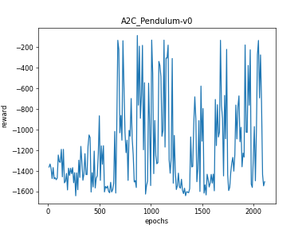
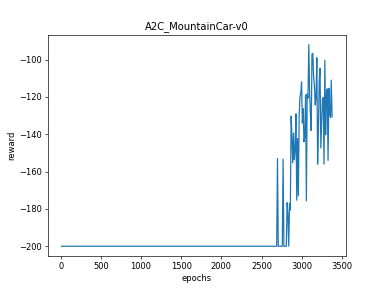
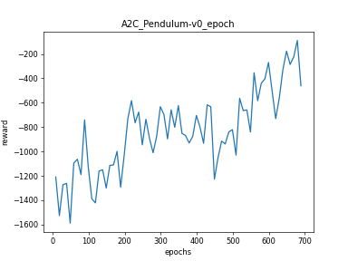

# A2C

## 1. 相关论文

[Asynchronous Methods for Deep Reinforcement Learning](https://arxiv.org/pdf/1602.01783.pdf)

## 2. 算法思路

### 2.1. 理论

同时训练一个负责选择行动的actor和一个负责评价的critic，actor的梯度为

$$ \nabla_\theta \mathcal{J}(\pi_\theta) = \underset{\tau\sim\pi_\theta}{\mathbb{E}}\left[ \sum^T_{t=0} \nabla_\theta \log \pi_\theta(a_t|s_t)A^{\pi_\theta}(s_t, a_t) \right]$$

其中advantage function为$$ A(s,a) = Q(s,a) - V(s) = r + \gamma V(s') - V(s) $$

critic的优化目标为

$$loss = L(r + \gamma V(s'), V(s))$$

### 2.2. 实现方式

A2C的实现可以实现为step后更新和epoch后更新两种，第一种是在每次与环境交互，获得```(s, a, r, s_, done)```数据后，立刻更新，第二种是类似TRPO和PPO，先收集```sample_size```的数据，然后利用batch进行更新。

第一种应该是比较朴素的A2C，见```a2c_algorithm_step_update.py```，每次与环境交互(```env.step(action)```)后，利用数据更新，然后丢掉数据。这种实现十分简单，但由于更新频率快，导致更新目标```target_q```不稳定，学习也很不稳定，波动大。完全不建议使用。

第二种```a2c_algorithm_epoch_update.py```效果应该是更好一些(但需要搭配GAE和obs normalize，不加这两个的时候甚至无法收敛)，这种不断与环境交互，获得```sample_size```大小的数据，然后利用所有的数据更新，由于获得了整条trace的数据，所以可以使用GAE获得更好的累计奖赏估计，更好地更新。这种实现稍微复杂了一些，需要更多的样本才能收敛，但也稳定了很多。这种的A2C相比PPO主要是少了trust region(更新可能过大)、重要性采样、许多实现上的tricks

### 2.3. 思考过的问题

#### 2.3.1. 自动求导信息的丢失

自动求导通过记录每个tensor做过的运算，建立计算图，在backward时计算梯度。

网络的输出结果，比如actor输出的```log_prob```，除了代表某个概率值外，还记录了从输入```state```到得到```log_prob```的一系列过程中的计算过程，这意味着如果更新参数的时候，不重新将```state```输入到网络中而是直接使用在采样时得到的```log_prob```的话，必须保留记录的用于自动求导的信息。

之前我在实现时总是容易不小心丢掉这些信息，比如希望存储在memory中的所有数据都是标量(做到统一)，所以将数据转化为标量；比如将```log_prob```数组转化为```tensor```时习惯使用```torch.tensor```的操作(但```torch.cat```就不会，```cat```操作会记录最后一个操作是```cat```，所以这就有了一个新的问题，什么)，这个操作会创建一个全新的tensor，丢失自动求导的信息。而这种错误一般是不会报错的(尽管torch会对没有)，因为在获得最终loss之前，一般会再做一些操作，比如用```log_prob```乘以```advantage```、求平均值等，所以最终的loss依然是可以做```backward```操作的，只是```log_prob```之前所有的梯度已经丢失，所以actor训练失败。

#### 2.3.2. On-policy算法中的batch

On policy中，怎么利用batch更新。按照on policy的定义，更新策略和采样策略必须是同一个策略，所以我之前认为必须只能使用上一个得到的数据立刻更新，那么如果使用batch多次更新的话，会导致从第二轮开始更新的策略和采样策略不同(因为需要更新的策略在第一轮已经更新过了，变化了)，就变成了off policy。

思考：我认为的完全的on policy的算法，必须使用前一个step的数据立刻更新，或者收集batch的数据之后，只更新一次。使用batch多次更新的方式，已经不算完全的on policy算法了，这种更新方式很接近off policy，虽然分类上依然是on policy算法。使用batch多次更新和完全的off policy算法的主要区别是on policy中，更新参数过后，必须清空所有的数据，重新收集，而off policy中，可以一直保留。

[深度解读：Policy Gradient，PPO及PPG](https://zhuanlan.zhihu.com/p/342150033)的6.1重要性采样部分

#### 2.3.3. sample时，一轮游戏不足够收集到```batch_size```大小的数据，游戏结束后重启并继续收集，会不会影响累计奖赏的计算

不会，只要在计算式中加入```(1-done)```的部分，不同轮数的数据不会相互影响。

## 3. 实验结果

### 3.1. Step update

实现了连续动作空间和离散动作空间上的A2C算法，并在```Pendulum-v0```和```MountainCar-v0```上进行了测试，两种实现的主要区别是，连续动作空间的策略网络输出高斯分布的均值和方差，然后在分布中采样，离散动作空间则是输出每个动作的概率，根据概率选择动作。

这种代码确实学到了一个好于随机策略的策略，但太弱了，训练慢、稳定性差、最终的奖赏也不高。应该是算法本身的问题，是因为算法本身是on policy的，每次只利用当前一个样本更新网络，样本利用率差，数据相关性强(违背了独立同分布的假设)，更新的网络和目标网络相关性强。

#### Pendulum-v0



在```Pendulum-v0```上有一定的效果，但训练轮数多(大概1000-2000轮才可以看到明显的改进)，结果总体不太好且不稳定。

#### MountainCar-v0



在```MountainCar-v0```上由于奖赏稀疏，会出现策略网络的损失很小(1e-3甚至更小)，但车无法达到山顶的问题，此时观察输出的策略概率，不存在某个策略概率特别大的情况，即比较接近随机策略，说明策略网络没有学到任何东西。需要做reward shaping，2500轮后可以学到(感觉纯靠运气爬上去了一次才学会的)。

### 3.2. Epoch update

这种明显好很多，更加稳定，效果更好(需要的样本也没有增长很多)，在mujoco上也能学到一点(略好于随机策略，比DDOG，TD3等还是差的不是一星半点)。

#### Pendulum-v0


