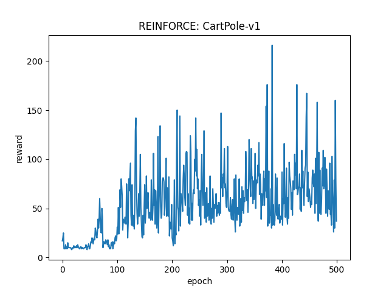

# REINFORCE

## 1. 简介

REINFORCE是策略梯度方法中最基本的一种。

策略梯度方法中，被优化的函数是性能度量函数$J(\theta)$，其中的$\theta$是策略参数，结合策略梯度定理和一些推导可以得到，$\nabla J(\theta)$与$G_t \frac{\nabla \pi(A_t | S_t, \theta_t)}{\pi(A_t | S_t, \theta_t)}$成正比，所以可以通过估计后面的值估计性能度量函数的梯度，进而通过梯度上升，不断提高性能。

在REINFORCE的基础上，可以增加baseline，baseline的作用是减小方差，提高训练速度。

## 2. 相关论文

Simple Statistical Gradient-Following Algorithms for Connectionist Reinforcement Learning.

## 3. 运行结果

环境为CartPole-v1。

感觉效果不太好，不知道是不是代码有问题，奖励收敛在大概75左右。