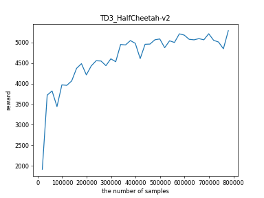
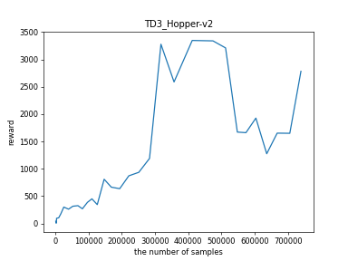
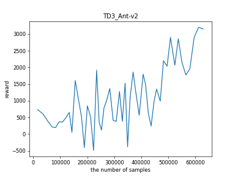

# TD3

## 相关论文

[Addressing Function Approximation Error in Actor-Critic Methods](https://arxiv.org/abs/1802.09477)

[Source code](https://github.com/sfujim/TD3)

## 算法思路

TD3全称是Twin Delayed DDPG，是DDPG的优化版本，针对因为函数近似的误差产生的overestimation bias和high varience问题进行优化。

1. Twin是critic使用两个Q网络估计(十分暴力的方法，将原来overestimate的值作为预测的值的上界，选择两个中的min，减小bias)，减少overestimate的影响。
2. Delayed是延迟更新actor，target actor和target critic网络，减慢更新稳定的值估计(target net和soft update，delayed update都是使得改变更慢，使得学习的过程更加稳定，RL最终稳定并且收敛，属于训练效率和训练稳定性之间的trade off)
3. 正则化方法，对动作加入高斯噪声，使得策略更加平滑(他们觉得DDPG中OU噪声没有用)

## 实验结果

TD3比DDPG更加稳定，且最终的效果也更好。训练过程中发现不同初始化会对训练过程造成一定影响，需要多次训练，但一般经过较多轮数，总会达到比较好的结果。

### HalfCheetah-v2

### Hopper-v2

### Ant-v2

